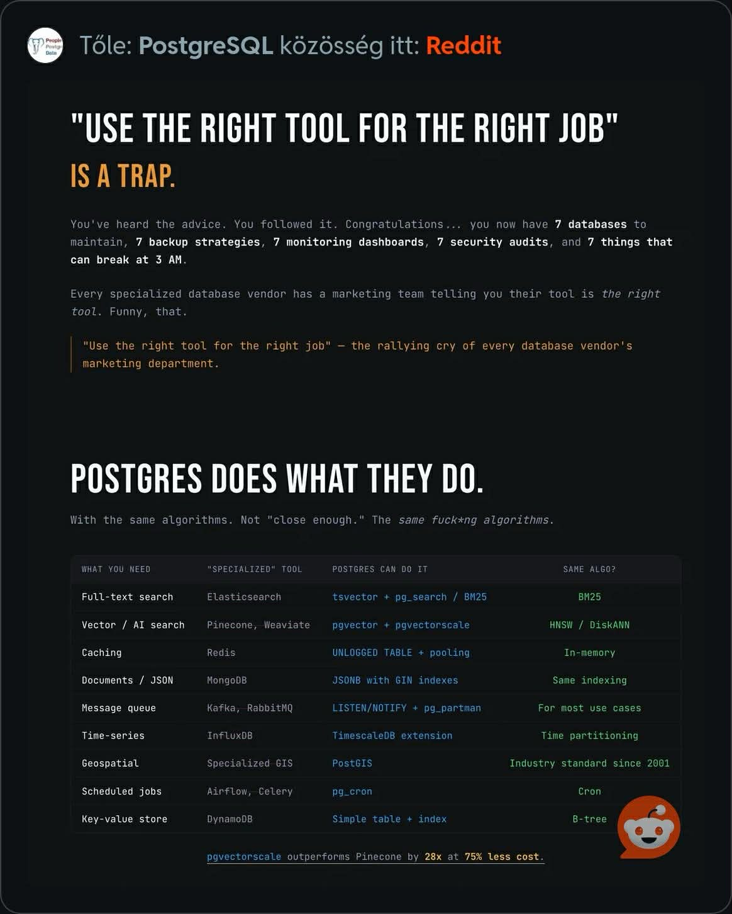

# Postgres VS MONGODB/ETCD/REDIS

Utána akarok járni hogy mennyire lehet a Postgres egy swájci bicska szerű eszköz így csökkentve a technológiai terheket.



## Postgres VS MongoDB

Mikor váltható ki? Az esetek 90%-ában. Ha szükséged van sémamentes mezőkre, de akarod a relációs integritást is, a Postgres jobb választás.

Mikor maradjon a Mongo? Ha extrém magas írási sebességre és vízszintes skálázódásra (sharding) van szükséged gyárilag.

```sql
-- Tábla létrehozása séma nélkül
CREATE TABLE documents (
    id SERIAL PRIMARY KEY,
    content JSONB
);

-- Adat beszúrása (mint a MongoDB-ben)
INSERT INTO documents (content) VALUES 
('{"name": "Laptop", "specs": {"ram": 16, "cpu": "i7"}, "tags": ["tech", "work"]}');

-- Keresés a JSON belsejében (indexelés után villámgyors)
SELECT * FROM documents WHERE content @> '{"name": "Laptop"}';
```

## Postgres VS ETCD

Az ETCD setup egyszerűbb ugyanis a Postgres-ben kell egy init ami az adatbázist megfelelően létrehozza.
Emiatt macerásabb is mert ki kell választani a DB-t illetve az authentikáció alapértelmezetten van.

Mikor váltható ki? Egyszerű alkalmazás-konfigurációk tárolására a Postgres tökéletes.

Mikor maradjon az ETCD? Ha Kubernetes-szintű cluszterezést vagy olyan rendszert építesz, ahol a hálózati partíciók (split-brain) kezelése kritikus.

```sql
CREATE TABLE kv_store (
    key TEXT PRIMARY KEY,
    value TEXT,
    updated_at TIMESTAMP DEFAULT NOW()
);

-- Beszúrás / Frissítés (Upsert)
INSERT INTO kv_store (key, value) VALUES ('public.config.max.connections', '100')
ON CONFLICT (key) DO UPDATE SET value = EXCLUDED.value;
```

## Postgres VS Redis

Az UNLOGGED tábla típus kell ha a Redis-szerű sebességet akarod megközelíteni. Mivel ez a tábla nem ír a WAL logot, az írási műveletek sokkal gyorsabbak, viszont cserébe egy rendszerösszeomlás után a tábla tartalma automatikusan törlődik.

Mikor váltható ki? Kisebb terhelésű cache-elésre vagy Background Job-ok kezelésére (pl. PGMQ vagy SKIP LOCKED technika).

Mikor maradjon a Redis? Ha milliszekundum alatti válaszidő kell és nem gond, ha egy áramszünetnél elveszik a gyorsítótár tartalma.

```sql
CREATE UNLOGGED TABLE temp_cache (
    session_id UUID PRIMARY KEY,
    data TEXT,
    expiry TIMESTAMP
);
```